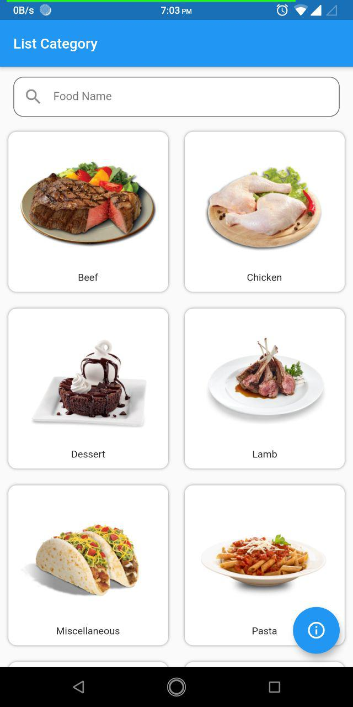
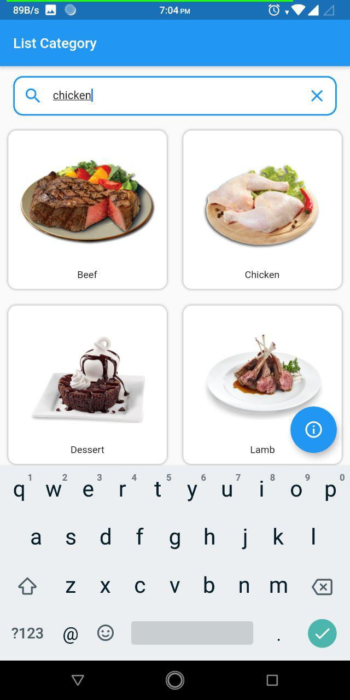
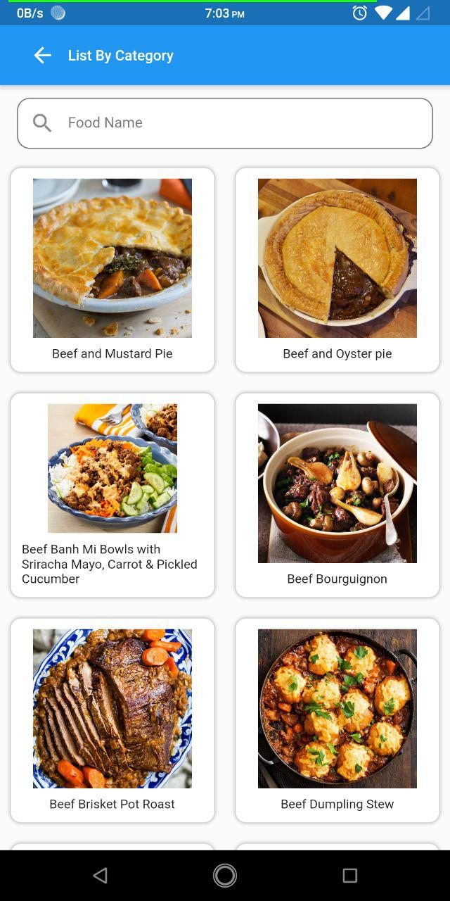
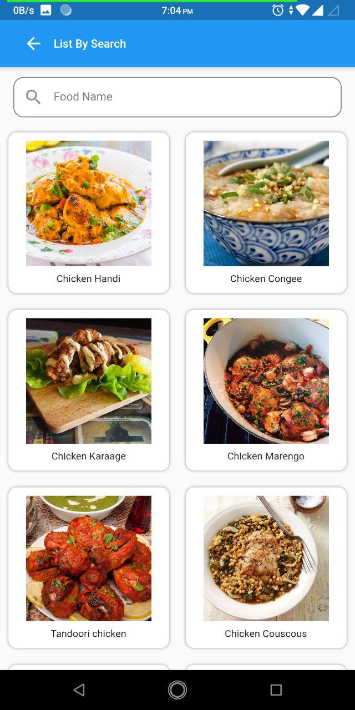
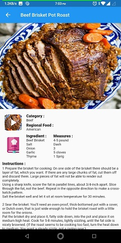
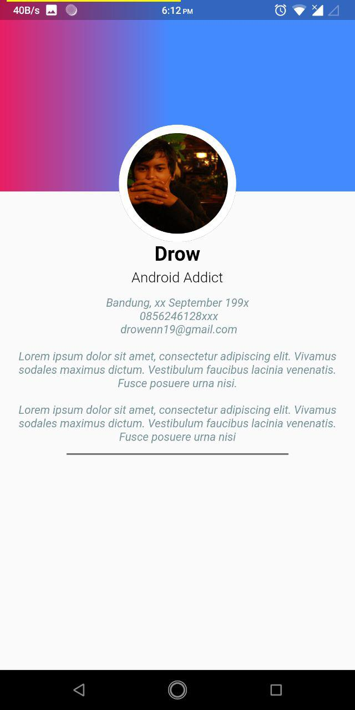

# FoodApp

APK : <a id="raw-url" href="https://github.com/drow19/FoodApp/tree/master/apk/FoodApp.apk">Download FILE</a>

HomePage :
 - Halaman utama yang menampilkan list category dan juga menu search untuk pencarian makanan  
  -----------------------------------------------------------------------------------------------------   
    
 
 
 FoodPage :
 - Halaman kedua yang menampilkan list berdasarkan category dan juga list berdasarkan search   
  -----------------------------------------------------------------------------------------------------   
 
 
DetailPage :
 - Halaman ketiga yang menampilkan list detail dari makanan dan juga menu video tutorial youtube  
 
DescriptionPage:
 - Halaman yang menampilkan biodata, deskripsi dan tujuan aplikasi, serta tools yang digunakan  
